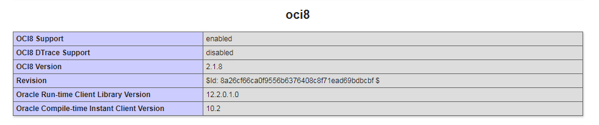

Setting up PHP for Oracle Database When working with Oracle databases for the first time, developers may find OCI8's complex procedures challenging. This blog post includes instructions for installing and configuring Oracle Instant Client and the OCI8 extension for PHP, as well as a step-by-step walkthrough for setting up PHP with OCI8. We also go over typical problems you can run into while configuring things and offer troubleshooting advice to help you fix them. You will have a functional PHP-OCI8 environment at the end of this blog, which you can use to create robust and scalable web apps that take advantage of Oracle Database's features.

Three things needed for connecting with oracle database with PHP.

```
- OCI8
- PHP
- Instant Client
```


Those three option should be the same version, same configuration with with each one. Suppose, if our machine has 64bit , then PHP, OCI and instant client should be the same 64Bit system.


# Step 1: Download PHP 7.2

[Download PHP 7.2](https://windows.php.net/downloads/releases/php-7.2.6-Win32-VC15-x64.zip)


Here, things to notice is:

1. PHP version 7.2
2. TS version
3. VC 15
4. X64


I explain what those words mean. First, TS mean it is thread safe. That mean, this program can multitask or multi threading enabled. Second, VC 15 means, VC15 (Visual Studio 2015 compiler) and include improvements in performance and stability. And we all know that x64 architecture.


# Step 2: Download Oracle Instant Client

[Oracle Instant Client](http://www.oracle.com/technetwork/topics/winx64soft-089540.html)


We need to download three packages from here.

1. Basic Package
2. SDK
3. ODBC

Though we’ve downloaded the PHP version x64 that’s why we are downloading the x64 version of Instant Client.

Make a directory in C drive and uncompress all the files to this directory.


Add a new Path to System Variable in our computer. And put the directory where is your Instant Client files  in the path value.

Create a new system variable: *TNS_ADMIN*

Point the directory in that value too.


**RESTART YOUR COMPUTER**


# Step 3: Download the actual OCI8 package

[Download OCI8 PHP Package](https://pecl.php.net/package/oci8)

You can download the latest version if you want . As we are using PHP version 7.2 select that version and Thread Safe respectably.

Extract that into: *YOUR_XAMPP_DIRECTORY/php/ext*       directory. Enable it by uncommeting

*extension=php_oci8_12c.dll*

*extension=php_oci8.dll*


Done! Check your phpinfo , a new OCI8 options are available in here.



THANKS