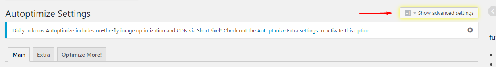
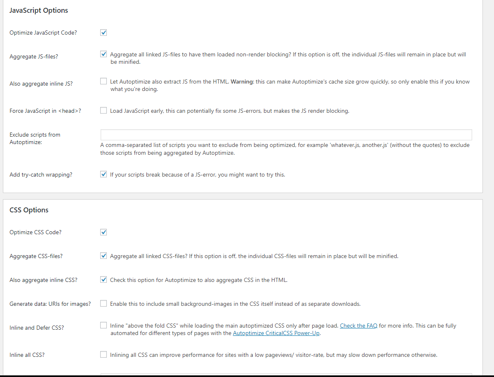

# Optimizing WordPress site

I'd read lots of articles about optimizing WordPress website but none of them provides a complete solution. Most of the posts are trying to sell their premium plugins or services which is annoying! So, I've decided to write one.   

I'll attach a custom wp-config, .htaccess files and all other files mentioned in this post.

## Some web sites for checking page speed

- Google Page Speed Insights ([visit](https://developers.google.com/speed/pagespeed/insights/))
- Pingdom ([visit](https://tools.pingdom.com))
- GT Matrix ([visit](https://gtmetrix.com/))

## Enabling WP Cache caching wp-config.php

For enabling WP cache, edit `wp-config.php` file in your wordpress's websites root directory and add those line below

```c
/* WordPress Cache */
define( 'WP_CACHE', true );
```

## Comporessing scripts and styles

Need to add some following constant values in `wp-config.php` file.  Make sure the following line is in wp-config.php and it is ABOVE the `“require_once(ABSPATH.’wp-settings.php’);”` line:

```c
/* Compression */
define( 'COMPRESS_CSS',        true );
define( 'COMPRESS_SCRIPTS',    true );
define( 'CONCATENATE_SCRIPTS', true );
define( 'ENFORCE_GZIP',        true );
```

This will compress css, javascripts, concatenate scripts to a single file and also enforce gzip compressing.

## Serving static assets with an efficient cache policy

 Static assets mean the images, CSS and js files which will not change frequently. And the `Cache policy` means, when a user or client visit again your website, the user needs to download those CSS, js, and images in every visit to render this website properly. So, we need to cache those files to user browser until clears up the cache. It can be done by using a simple `.htaccess` file.

## Turning on gzip compression

 Gzip is a technology that compress the HTTP responses so it will reduces the size.
 
```bash
gzip on;
gzip_disable "MSIE [1-6]\.(?!.*SV1)";
gzip_vary on;
gzip_types text/plain text/css text/javascript image/svg+xml image/x-icon application/javascript application/x-javascript;
```

### Add those following line in `.htaccess` file

```bash
# Compress HTML, CSS, JavaScript, Text, XML and fonts
AddOutputFilterByType DEFLATE application/javascript
AddOutputFilterByType DEFLATE application/rss+xml
AddOutputFilterByType DEFLATE application/vnd.ms-fontobject
AddOutputFilterByType DEFLATE application/x-font
AddOutputFilterByType DEFLATE application/x-font-opentype
AddOutputFilterByType DEFLATE application/x-font-otf
AddOutputFilterByType DEFLATE application/x-font-truetype
AddOutputFilterByType DEFLATE application/x-font-ttf
AddOutputFilterByType DEFLATE application/x-javascript
AddOutputFilterByType DEFLATE application/xhtml+xml
AddOutputFilterByType DEFLATE application/xml
AddOutputFilterByType DEFLATE font/opentype
AddOutputFilterByType DEFLATE font/otf
AddOutputFilterByType DEFLATE font/ttf
AddOutputFilterByType DEFLATE image/svg+xml
AddOutputFilterByType DEFLATE image/x-icon
AddOutputFilterByType DEFLATE text/css
AddOutputFilterByType DEFLATE text/html
AddOutputFilterByType DEFLATE text/javascript
AddOutputFilterByType DEFLATE text/plain
AddOutputFilterByType DEFLATE text/xml

# Remove browser bugs (only needed for really old browsers)
BrowserMatch ^Mozilla/4 gzip-only-text/html
BrowserMatch ^Mozilla/4\.0[678] no-gzip
BrowserMatch \bMSIE !no-gzip !gzip-only-text/html
Header append Vary User-Agent
```

**Note:** This is only works on Apache Server. If you are running in NGINX server, add following line to `nginx.conf` file.

If you are using plugins like `wp super cache` or `w3 total cache` those plugins have option for enabling Gzip to your site. For WP Super Cahce, go to the **WordPress dashboard > WP Super Cache > Advanced** > check the box for Compress pages so they’re served more quickly to visitors.

## Leverage Browser Caching in WordPress

```bash
# Begin EXPIRES CACHING - WpFASTER
<IfModule mod_expires.c>
ExpiresActive On
ExpiresByType image/jpg "access 1 year"
ExpiresByType image/jpeg "access 1 year"
ExpiresByType image/gif "access 1 year"
ExpiresByType image/png "access 1 year"
ExpiresByType text/css "access 1 month"
ExpiresByType text/html "access 1 month"
ExpiresByType application/pdf "access 1 month"
ExpiresByType text/x-javascript "access 1 month"
ExpiresByType application/x-shockwave-flash "access 1 month"
ExpiresByType image/x-icon "access 1 year"
ExpiresDefault "access 1 month"
</IfModule>
## End EXPIRES CACHING
```

## Serve images through CDN

 [Cloudinary](https://cloudinary.com/) is good service for images. It allows image resizing, editing and also CDN services. It is good to serving images which will not frequently be changed. Cloudinary free plan gives 25GB storage and bandwidth. Which is enough for a personal and small business website which does not image heavy. Disclimar: Cloudinary doesn't sponsored this post :p 

## Minify JS, CSS and combine to one file

There's are some way of manually minifing JS or CSS files, If it is a javascript site I will use webpack or gulp for this task. I've searched a lot for integrating gulp or webpack with wordpress. If you know please let me know in the comment section. But there is a plguin name `autoptimize` which will do this job pretry well.

 - Install [autoptimize](https://wordpress.org/plugins/autoptimize/)
 - Go to **settings > autoptimize > show advanced settings**
  
 - Make sure you've marked this with options exact same as below
  

## Files for this post

Here you can find all of the files in the post [Gist Link](https://gist.github.com/marufmax/c5a20f59016bf99eae56ab1b69cfd440)

## Thanks for reading