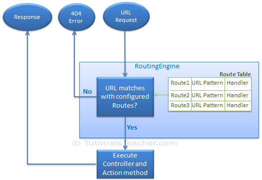

# **What is route?**

Route is used for receive URL pattern and handler information. Sounds chunky! Well, A route is a URL that contains information from Controller or A function. 

A route is used for handling HTTP requests. In MVC framework we called HTTP request as Event. Laravel provides a powerful routing system that allows to define both RESTful paths (http//site.com/restful/path)


Laravel routes are defined in **Routes/web.php**

# **Laravel Basic Routing**

Laravel makes a routing in web application much easier and simpler. Laravel accept a URI and a closure function. We will talk about closure letter. Suppose, You want to show your viewers “Welcome to my blog” in homepage.

```c
Route::get('welcome', function () {
    return 'Welcome to my blog';
});
```


Here, We send a HTTP GET request to server and a closure function.

# **What is Clouser?**

Closure is a function that has access to the outer functions variable. In PHP, clouser is a anonymous function that can pass around as object, assign to a variable, pass as a parameter to other functions and methods.

# **What happen in that code?**

This teaches the laravel router that, Hey! I see you hit ‘welcome’ address of my domain So, I have to run that clouser function then I have to return ‘Welcome to my blog”. Remember, I am not echo-ing or printing anything I just return a result. So, you can return a function, page variable or a parameter also!