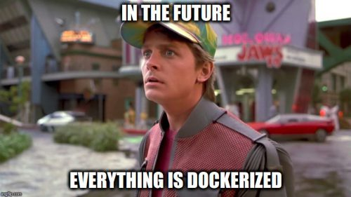
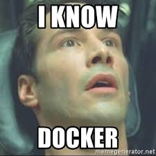

ডকার শেখা দরকার কিন্তু সময় পাচ্ছি না! অথবা ইন্ট্রোডাকশন ভিডিও বা আর্টিকেল পড়ে সময় নষ্ট হয়ে যাচ্ছে কিন্তু আসল জিনিস শেখা হচ্ছে না তাদের জন্য এই লেখা।

## বহুল ব্যাবহৃত কমান্ড-সমূহ

### docker run <image>

এই কমান্ড-টি কোন একটি নিদৃষ্ট ইমেজ `রান` করে । হোস্ট হিস্টেম (মানে যে কম্পিউটারে ডকার চলছে, ওয়ার্ড-টা মনে রাখুন) না পেলে ডকারহাব থেকে ডাউনলোড করে নিয়ে এসে `run` করবে।

উদাহরণঃ `docker run nginx`

##### docker run -d <image>

`-d` এই ফ্লাগ দিয়ে মূলত কোনো ইমেজকে ব্যাকগ্রাউন্ডে রান করার জন্য। মানে, এটা কোনো ইমেজ রান করবে তারপর সেটা আপনার কম্পিউটারে ব্যাকগ্রাউন্ডে চলতে থাকবে। এই ডি `(-d)` দিয়ে বোঝানো হয় `Detached` ভাবে কোনো কন্টেইনারকে রান করার জন্য। সিম্পলি মনে রাখেন, কোনো কন্টেইনার রান করে যদি টার্মিনাল-টা আবার ইউজ করতে চান :stuck_out_tongue_closed_eyes:

### docker stop <container>

বোঝাই যাচ্ছে কোনো রানিং কন্টেইনার-কে স্টপ করে দিবে। এখানে বিষয় হচ্ছে প্যারামিটার/আর্গুমেন্ট(যেটা বলে খুশি থাকেন) আকারে কন্টেইনার এর আইডি অথবা নাম লিখলেও স্টপ হয়ে যাবে। স্টপ এর বাংলা বন্ধ হওয়া :stuck_out_tongue_closed_eyes:

### docker ps

কি কি কন্টেইনার হোস্ট সিস্টেমে চলছে সেগুলো টেবিল আকারে দেখাবে এবং তাদের স্ট্যাটাসও দেখা যাবে। মানে কন্টেইনার আইডি, কখন তৈড়ি হয়েছে, বর্তমানে রানিং অথবা স্টপড কিনা এসব দেখা যাবে।

##### docker ps -a

এটা `ps` কমান্ডের একটা ফ্লাগ, এটা দিলে শুধুমাত্র বন্ধ হওয়া কন্টেইনার দেখা যাবে। ডকারওয়ালারা এটাকে এক্সিট স্টেট বলে।

### docker rm <container>

কোনো কন্টেইনার-কে ডিলেট/রিমুভ করার জন্য। এখানে মোস্ট ইম্পর্টেন্টলি, এটা শুধু `কন্টেইনার` রিমুভ করবে `ইমেজ` রিমুভ করবে না। কন্টেইনার এবং ইমেজ এর পার্থক্য বুঝতে ধৈর্য্য ধরে পড়তে থাকুন।

### docker images

কি কি ইমেজ হোস্ট সিস্টেমে (মানে আপনার কম্পিউটারে/সার্ভারে) আছে সেগুলোর একটা লিস্ট দেখাবে।

### docker rmi <image>

আগের `rm` এর সাথে `i` যোগ হইছে কিন্তু কাজ একই। `i` মানে ইমেজ, সো বুঝতেই পারছেন এটা কোনো ইমেজ ডিলেট করবে। খেয়াল রাখা জুরুরী, কোনো ইমেজ ডিলেট করার আগে সেই ইমেজ ব্যাবহৃত হচ্ছে এমন সব কন্টেইনারও ডিলেট অথবা স্টপ করে দিতে হবে তা না হলে ওই ইমেজ ডিলেট হবে না।

### docker pull <image>

`run` কমান্ড এর কথা তো মনে আছে, ওইযে হোস্ট সিস্টেম বা ডকারহাব থেকে ইমেজ রান করবে। এটাও সেইম জাস্ট `run` টা করবে না। শুধু ডকারহাব থেকে ইমেজ নামিয়ে রাখবে। অনেকটা গিটে আমরা পুল করি না, তেমন।

### docker exec <container> <command>

কোনো কন্টেইনার এর ভেতরে কোনো কমান্ড রান করতে চান তাহলে `exec` ব্যাবহার করতে হবে। `exec` মানে এক্সিকিউশন :handshake:

উদাহরনঃ `docker exec jibon-e-onek-kosto cat /etc/hosts`

এখানে আমি `jibon-e-onek-kosto` কন্টেইনার এ `cat` নামক একটা কমান্ড এক্সিকিউট করেছি এবন সেই কমান্ডের প্যারামিটার হিসেবে `/etc/hosts` দিয়েছি।

### docker logs <container>

বুঝতেই পারছেন এটি কোনো কন্টেইনার এর লগ দেখার কাজে ব্যাবহৃত হয়। এটি একটি দরকারী কমান্ড ডিবাগিং এর ক্ষেত্রে।

## কনসেপ্টস

না ভাই আমি ডকার এর আর্কিটেকচারাল কনসেপ্ট নিয়ে আলোচনা করতে আসি নাই।

জীবনে চলতে গেলে যেসব বিষয়য়াদি সম্পর্কে ধারণা থাকা দরকারঃ

- ডকার ইমেজ যতক্ষণ প্রর্যন্ত ব্যাবহার হচ্ছে ততক্ষণ প্রর্যন্ত রানিং থাকে। কেউ ইউজ না করলে নিজে নিজেই স্টপ হয়ে যায়।

- hub.docker.com ==> এটা অনেকটা গিটহাবের মত। বিভিন্ন মানুষজন তাদের ইমেজ বা কন্টেইনার শেয়ার করে। গিটহাবের মতই প্রাইভেট ভাবেও ইমেজ রাখা যায়। কিন্তু এটা ছাড়াও এরকম আরো কিছু সাইট আছে, গিটের জন্য যেমন গিটল্যাব, বিটবাকেট এসব আছে তেমনি ডকার হাব এর মত https://quay.io ইত্যাদি আছে।

- ডকার `run` কমান্ড সবসময় `latest` ভার্শন-টাই পুল করে। অনেকটা গিট থেকে ক্লোন করলে যেমন মাস্টার ব্রাঞ্চ ডিফটভাবে পুল হয় তেমন। কোনো স্পেসিক ভার্শন `run` বা `pull` করতে চাইলেঃ `docker run nginx:1.17.8` মানে ইমেজের পর কোলন দিয়ে ভার্শন-টা দিতে হবে।

### কন্টেইনার vs ইমেজ

**ইমেজ**-কে মনে করতে পারেন আপনার ফ্রেমওয়ার্ক এর মত। মানে আপনি ফ্রেমওয়ার্ক নিয়ে কাজ করছেন লারাভেল,জ্যাঙ্গো,এক্সপ্রেস ইত্যাদি এদের নিজেদের কিছু ফাইল আছে যেগুলো হয়তো vendor, node_modules ইত্যাদি ফোল্ডারে জমা হয়ে থাকে। আপনি সাধারণত ফ্রেমওয়ার্কএর নিজের ফাইল এডিট করতে যান না, তাই না? ডকার ইমেজকেও সেরকম ভাবতে পারে। এটি একরকম ফাইল বা প্রোগ্রাম যার উপর ভিত্তি করে আপনি কাজ করবেন

টেকনিক্যালি ইমেজ হচ্ছে কোনো কন্টেইনার এর স্নাপশট। আপনি চাইলে আপনার নিজের তৈড়ি করা কন্টেইনার-কেও `build` কমেন্ড দিয়ে ইমেজ আকারে বানিয়ে ফেলতে পারবেন।

​ **কন্টেইনার** হচ্ছে ছোটখাটো কোনো প্রোগ্রাম বা এ্যাপ্লিকেশন যার যেটি আপনি পরিচালনা করতে পারেন। অন্যভাবে বলতে গেলে, কন্টেইনার হচ্ছে রানিং ইমেজ! অথবা উপরের ফ্রেমওয়ার্ক এর উদাহরণ দিয়ে বলা যায়, কন্টেইনার হচ্ছে ফ্রেমওয়ার্ক ব্যাবহার করে বানানো আপনার এ্যাপ্লিকেশন। ডকার নিয়ে কাজ করার সময় বেশিরভাগ সময় আপনাকে কন্টেইনার নিয়েই কাজ করতে হবে।

আশা করি ব্যাস্ততার ভেতরেও কিছুটা হলে ডাকার সম্পর্কে ধারণা পেয়েছেন। আশা করছি আপনারা ডকার ডাউনলোড করে এইগুলো নিজে নিজে করে দেখতে। ডকার এর ওয়েবসাইটেই ডাউনলোড এর অপশন আছে। পরে আবার কোন একদিন কিভাবে কোনো এ্যাপ্লিকেশন-কে ডকারাইজ করতে হয় সেসব নিয়ে আলোচনা করবো।

ধন্যবাদ :cherry_blossom:
