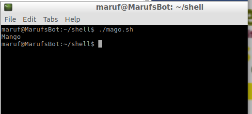
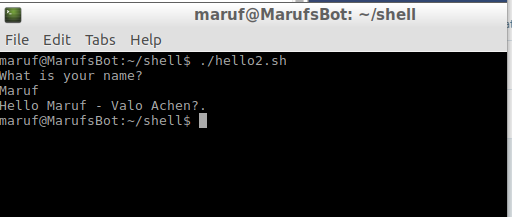

# ভেরিয়েবলস
অনান্য সব প্রোগ্রামিং ল্যাঙ্গুয়েজ এর মতই শেল স্ক্রিপ্টেও আছে ভেরিয়েবল এর ব্যাবহার। ভেরিয়েবল হচ্ছে এক প্রকার পাত্রের মত যা কিছু মেমরির যায়গা দখল করে রাখে। ভেরিয়েবল এর নাম আম জাম কাঠাল যা কিছুই হতে পারে!

# **কিভাবে ভেরিয়েবল ডিক্লেয়ার করবো?**

সিম্পল!

> Fruit=”Mango”

হয়ে গেল আমাদের প্রথম ভেরিয়েবল ডিক্লেয়ারেশন। এখানে আমরা Fruite নামে একটা ভেরিয়েবল ডিক্লেয়ার করেছি যার ভ্যালু দিয়েছি Mango।  মনে রাখতে হবে, আমরা যে নামটি দিবো আর যে ভ্যালু থাকবে তার মাঝখানে = চিহ্নের ভেতর কোন স্পেস রাখা যাবে না।

আমরা এবার এটাকে প্রোগ্রামে লিখে প্রিন্ট করে দেখি

```bash
#!/bin/sh
Fruit="Mango"
echo $Fruit
```

প্রথমবারের প্রোগ্রামের মত করে পার্মিশন দিয়ে (chmod 755) দিয়ে রান করুন।



# ভেরিএবল টাইপ্

প্রোগ্রামিং এর ক্ষেত্রে টাইপ বলতে বোঝায় ডেটা টাইপ। যেখানেই টাইপ নামক শব্দ দেখবেন তখনি বুঝে নিবেন এখানে ডেটা এর টাইপ নিয়ে বলা হচ্ছে(বেশিরভাগক্ষেত্রেই) । আমরা জানি ডেটার বিভিন্ন রকমের টাইপের হয়ে থাকে, এই যেমন, ইন্টেজার, ডাবল, স্ট্রিং ইত্যাদি। তবে  শেল স্ক্রিপ্টে কোন ভেরিয়েবলস টাইপ এর কোন বিষয় নেই। ইন্টেজার,স্ট্রিং,ফ্লোট ইত্যাদি ঝামেলা এখানে নাই। শেল ক্রিপ্টে সবাই স্ট্রিং হিসেবে গন্য হবে !

এখন আমরা ইউজার এর কাছ থেকে ইনপুট নিয়ে সেটি প্রিন্ট করার স্ক্রিপ্ট দেখবো।

```bash
#!/bin/sh
echo What is your name?
read MY_NAME
echo "Hello $MY_NAME - Valo Achen?."
```

এটিও আপনার পছন্দের এডিটরে লিখে সেভ করুন। তারপর রান করে দেখুন।

